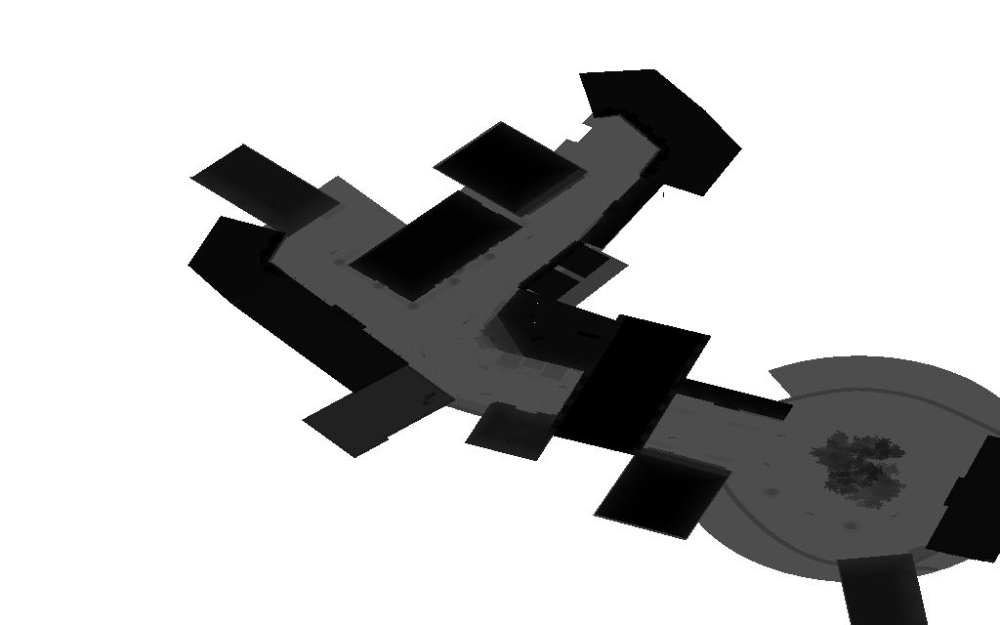
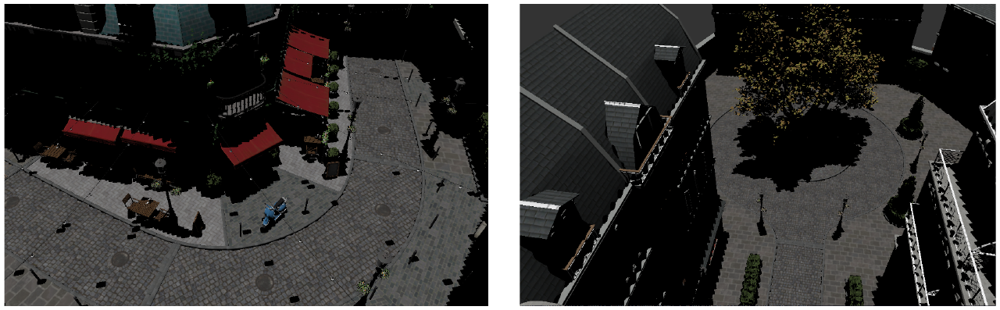
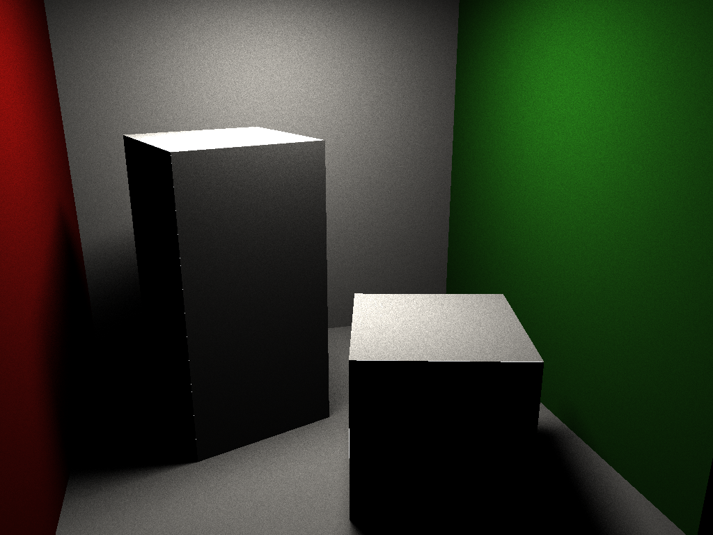

version minimaliste de gkit2light, sans dependances ni openGL.

consultez la [doc](https://perso.univ-lyon1.fr/jean-claude.iehl/Public/educ/M1IMAGE/html/group__installation.html) en ligne pour la création des projets, cf "étape 3 : générer les projets" ainsi que "étape 5 : créer un nouveau projet". 

Projet effectué par : BONIS Alexis 11805132

<h2>Branches</h2>

La branche "main" contient le travail sur le raytracing effectué lors de la première année de master, la branche "raytracingmontecarlo-shadowmap" contient le travail effectué pour le raytracing utilisant l'estimateur de Monte Carlo ainsi que les Shadow Maps en deuxième année de master, et enfin la branche "multidrawindirect" contient l'implémentation de la méthode MultiDrawIndirect d'OpenGL sur GPU  également éffectué en deuxième année de master.

<h2>Travail effectué</h2>

Dans ce projet, nous avons implémenté l'affichage d'un objet avec ses textures appliquées au bon endroit en utilisant la librairie OpenGL dans le TP1.

Le TP2 consiste à afficher une scène détaillée en implémentant le Frustum Culling, nous permettant d'afficher uniquement les groupes de triangles visibles par la caméra. Nous avon également implémenté le système de Shadow Map qui correspond à une méthode d'affichage des ombres.

Le TP3 correspond à l'application de la tachnique de l'éclairage direct en utilisant l'estimateur de Monte Carlo sur une scène simple.

Les fichiers source du projet se trouvent dans le dossier projets/

Pour compiler le projet, pensez à faire cette commande : make -j4 config=release tp1 (pour compiler le tp1 par exemple)

Pour executer faites simplement la commande ./bin/tp1 et l'image apparaitra sous le nom de "image.png" à la racine du projet.

Voici quelques images résultats :

TP2:

TP3 :
