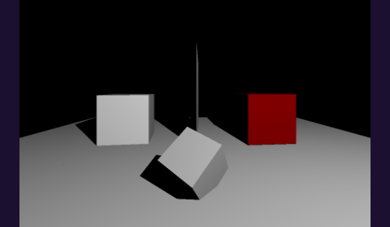
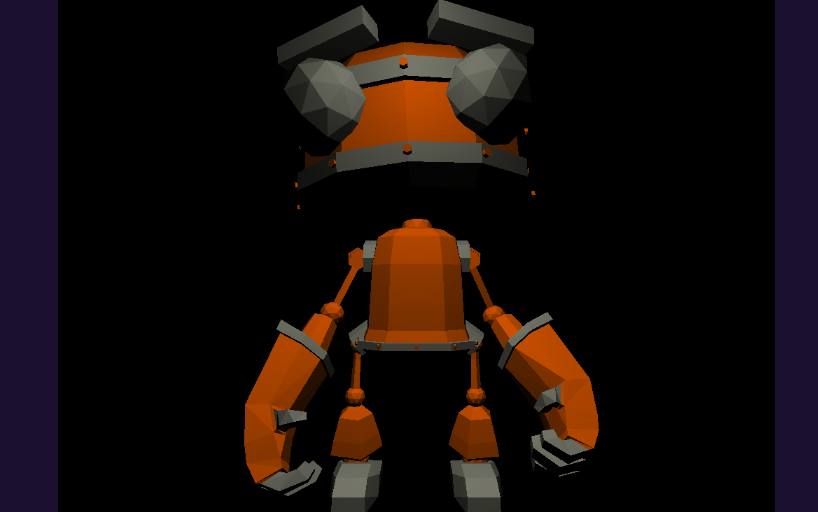

version minimaliste de gkit2light, sans dependances ni openGL.

consultez la [doc](https://perso.univ-lyon1.fr/jean-claude.iehl/Public/educ/M1IMAGE/html/group__installation.html) en ligne pour la création des projets, cf "étape 3 : générer les projets" ainsi que "étape 5 : créer un nouveau projet". 

Projet effectué par : BONIS Alexis 11805132

<h2>Branches</h2>

La branche "main" contient le travail sur le raytracing effectué lors de la première année de master, la branche "raytracingmontecarlo-shadowmap" contient le travail effectué pour le raytracing utilisant l'estimateur de Monte Carlo ainsi que les Shadow Maps en deuxième année de master, et enfin la branche "multidrawindirect" contient l'implémentation de la méthode MultiDrawIndirect d'OpenGL sur GPU  également éffectué en deuxième année de master.

<h2>Travail effectué</h2>

Dans le dossier "tp2_exos" vous trouverez les anciennes parties que j'ai précédemment effectué. J'ai un peu laissé ces fichiers à l'abandon, mais si vous voulez voir la fonction du zbuffer par exemple, qui se trouve dans le fichier "tp1_partie3.cpp" où on peut également voir le robot (sans les ombres).

Le vrai fichier final est "tp2.cpp" se trouvant dans le dossier "projets".

Pour compiler le projet, pensez à faire cette commande : make -j4 config=release , notamment pour le robot (pour le fichier "tp2_partie3.cpp", car dans "tp2.cpp" je n'ai pas fait de BVH donc le chargement du robot sera tros long, même en mode release).

Pour executer faites simplement la commande ./bin/tp2 et l'image apparaitra sous le nom de "image.png" à la racine du projet.

Voici quelques images résultats :

