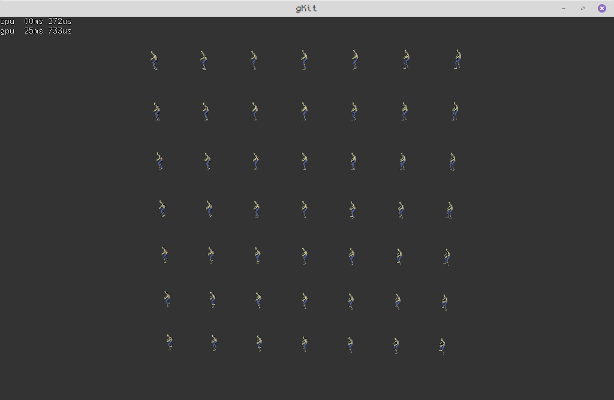
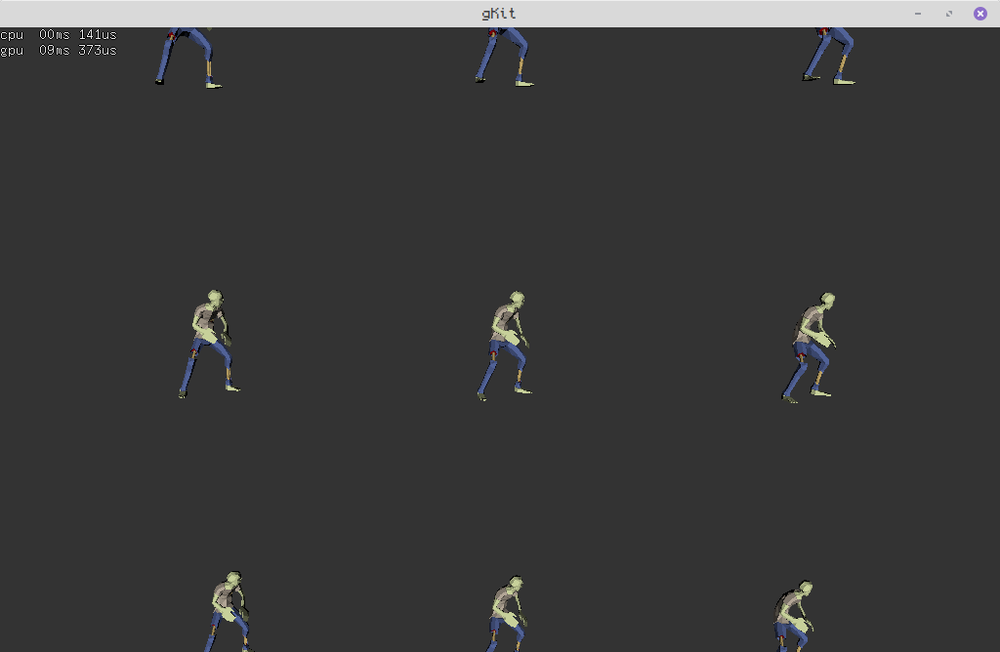
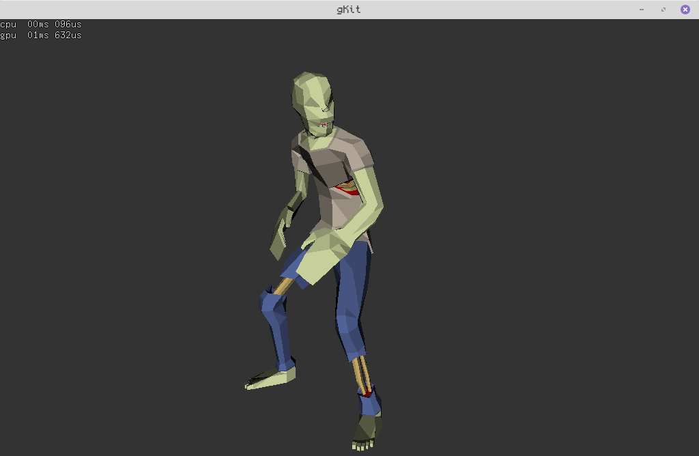

version minimaliste de gkit2light, sans dependances ni openGL.

consultez la [doc](https://perso.univ-lyon1.fr/jean-claude.iehl/Public/educ/M1IMAGE/html/group__installation.html) en ligne pour la création des projets, cf "étape 3 : générer les projets" ainsi que "étape 5 : créer un nouveau projet". 

Projet effectué par : BONIS Alexis 11805132

<h2>Branches</h2>

La branche "main" contient le travail sur le raytracing effectué lors de la première année de master, la branche "raytracingmontecarlo-shadowmap" contient le travail effectué pour le raytracing utilisant l'estimateur de Monte Carlo ainsi que les Shadow Maps en deuxième année de master, et enfin la branche "multidrawindirect" contient l'implémentation de la méthode MultiDrawIndirect d'OpenGL sur GPU  également éffectué en deuxième année de master.

<h2>Travail effectué</h2>

Ce projet contient de la programmation de rendu sur GPU à l'aide de shader en glsl.
La méthode du MultiDrawIndirect d'OpenGL a été utilisée ainsi que le Frustum Culling pour afficher les objets.

Le fichier source du projet se trouve dans projets/tp2.cpp

Pour compiler le projet, pensez à faire cette commande : make -j4 config=release tp2

Pour executer faites simplement la commande ./bin/tp2.

Voici quelques images résultats :

